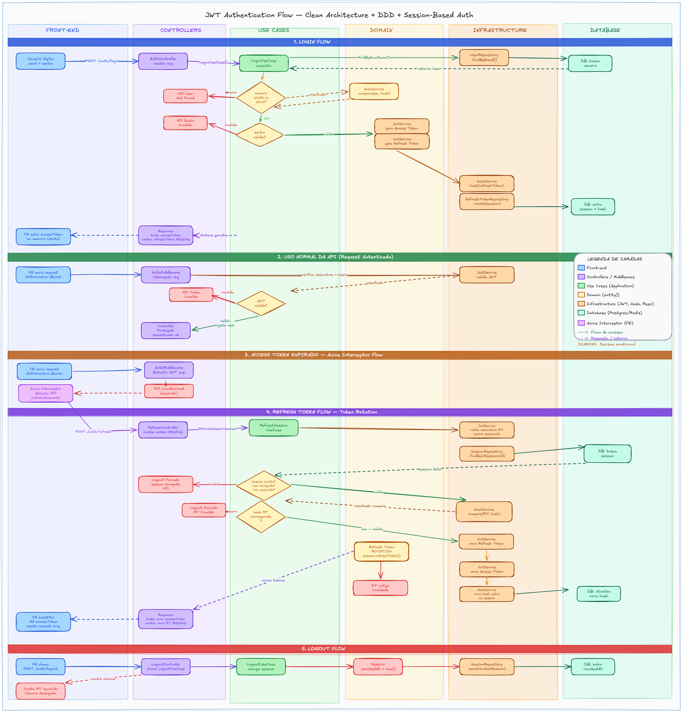
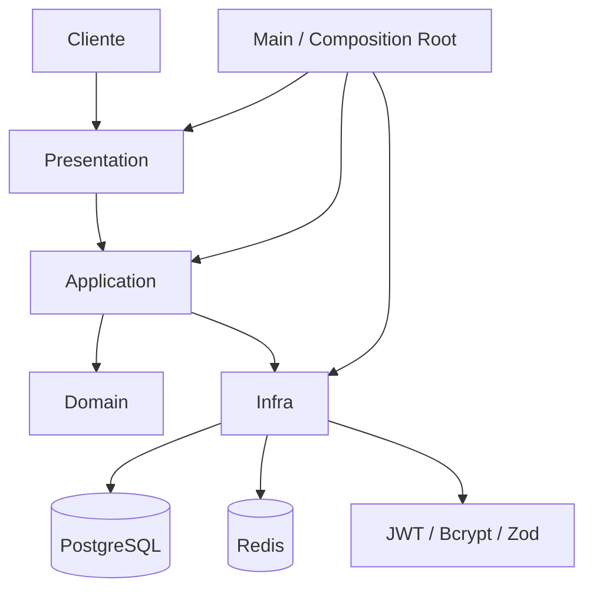
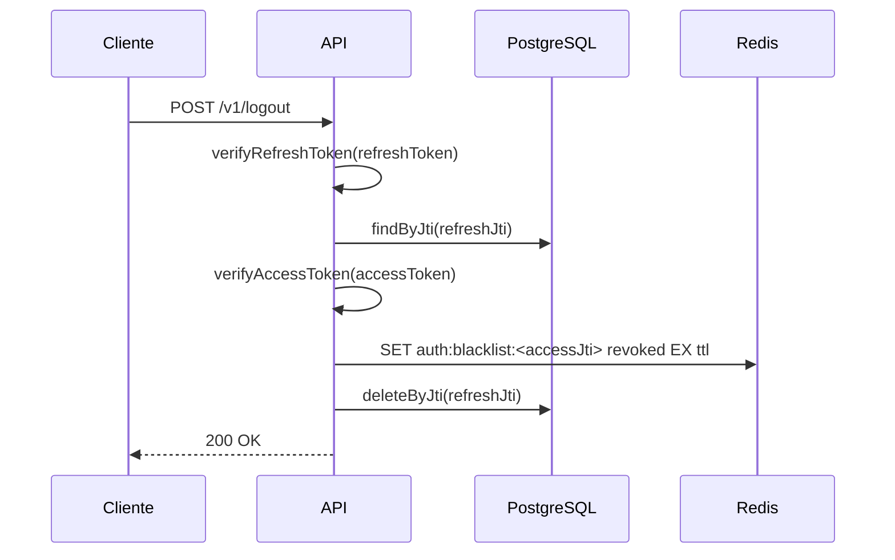

# OAuth Authentication API

API de autenticacao desenvolvida como projeto academico para estudar JWT, gerenciamento de sessao com Redis, Clean Architecture, DDD, SOLID e TDD.

O foco nao e apenas autenticar usuarios. O objetivo e modelar um fluxo mais proximo de producao, com sessao persistida, refresh token com rotacao, blacklist de access token no logout e separacao clara de responsabilidades entre as camadas.

## Visao Geral

- Cadastro de usuarios.
- Login com `accessToken` e `refreshToken`.
- Refresh com rotacao de sessao.
- Logout com revogacao da sessao e blacklist do access token.
- Endpoint autenticado para perfil do usuario.
- Rate limit com Redis.
- Validacao centralizada com Zod.
- Testes automatizados com Jest.

## Como Pensei a Arquitetura

O projeto foi organizado para deixar cada responsabilidade no seu lugar.

- `domain` concentra entidades, value objects e contratos.
- `application` concentra regras de caso de uso e orquestracao.
- `presentation` trata HTTP, cookies, headers e middlewares.
- `infra` implementa banco, cache, hash, token e validacao.
- `main` faz a composicao das dependencias e sobe a aplicacao.

As decisoes centrais foram estas:

- PostgreSQL e a fonte de verdade para usuarios e sessoes.
- Redis e usado apenas para preocupacoes temporarias, como blacklist e rate limit.
- Refresh token e salvo em hash, nunca em texto puro.
- Access token tem vida curta e pode ser bloqueado imediatamente no logout.
- O middleware bloqueia requisições antes de chegar na camada de aplicacao.
- As factories mantem a composicao desacoplada e facil de testar.

## Diagramas

### Fluxo de Refresh Token



### Arquitetura em Camadas



### Logout e Blacklist



## Estrutura do Projeto

```txt
src/
  domain/
  application/
  infra/
  presentation/
  main/
tests/
docs/
prisma/
```

## Tecnologias

- Node.js
- JavaScript
- Express
- Prisma ORM
- PostgreSQL
- Redis
- Docker
- Docker Compose
- GitHub Actions
- JWT
- Bcrypt
- Zod
- OpenAPI
- Swagger UI
- Jest

## Variaveis de Ambiente

Use `.env.example` como base. Os valores essenciais sao:

```env
DATABASE_URL=postgresql://...
REDIS_URL=redis://redis:6379
JWT_ACCESS_SECRET_KEY=your_access_secret
JWT_REFRESH_SECRET_KEY=your_refresh_secret
ACCESS_TOKEN_EXPIRES_IN=15m
REFRESH_TOKEN_EXPIRES_IN=7d
ACCESS_TOKEN_COOKIE_MAX_AGE_MS=900000
REFRESH_TOKEN_COOKIE_MAX_AGE_MS=604800000
BCRYPT_SALT=12
PORT=8080
```

## Como Executar

```bash
git clone <repo-url>
cd oauth-authentication
cp .env.example .env
docker compose up --build
```

Se preferir rodar sem Docker, instale as dependencias e inicie o projeto com os servicos necessarios ja disponiveis:

```bash
npm install
npm run dev
```

## Banco de Dados

As migrations ficam em `prisma/migrations`.

Para aplicar as migrations:

```bash
npx prisma migrate deploy
```

## Scripts

```bash
npm run dev
npm start
npm test
npm run lint
```

## Endpoints

### Auth

| Metodo | Rota | Descricao |
|---|---|---|
| POST | `/v1/login` | Login do usuario |
| POST | `/v1/refresh` | Rotacao da sessao usando o refresh token |
| POST | `/v1/logout` | Revoga a sessao e grava o access token na blacklist |

Observacao: `POST /v1/logout` espera o `refreshToken` no cookie HttpOnly e o `accessToken` no header `Authorization: Bearer <token>`.

### Usuario

| Metodo | Rota | Descricao |
|---|---|---|
| POST | `/v1/user/register` | Cadastro de usuario |
| GET | `/v1/user/me` | Retorna o usuario autenticado |

## Swagger / OpenAPI

A documentacao interativa fica disponivel em `/docs`.

- Spec OpenAPI: `src/main/config/openapi.js`
- JSON bruto da spec: `/docs/openapi.json`
- Autenticacao por `bearerAuth` para `accessToken`
- Autenticacao por `refreshTokenCookie` para `refreshToken`
- Logout exige `refreshToken` no cookie HttpOnly e `accessToken` no header `Authorization`

## Documentacao Complementar

- [Swagger UI](http://localhost:8080/docs)
- [Spec OpenAPI](src/main/config/openapi.js)
- [Fluxo de refresh token](docs/refresh_token_flow.png)
- [Erros e cenarios de validacao](docs/ERRORS.md)

## Qualidade

O projeto possui testes automatizados, separacao clara de responsabilidades e lint configurado para manter o codigo consistente.

Antes de publicar ou demonstrar o projeto, rode:

```bash
npm test
npm run lint
```

## Roadmap

- Rotacao avancada de refresh token.
- RBAC.
- Autenticacao em dois fatores.
- Observabilidade e logs.
- Testes de integracao.
